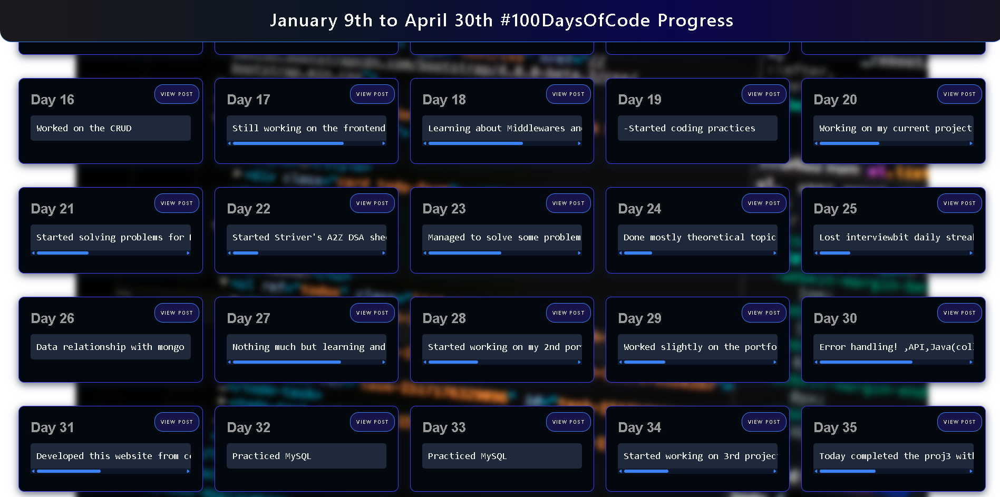

# 100 Days of Code Progress Tracker

This is a lightweight, static web app that visually tracks my complete 100 Days of Code journey. Instead of keeping progress scattered across social posts, everything is structured, rendered dynamically, and accessible from a single page.

The project reads daily progress data from a JavaScript file and renders each day as a card with a short summary and a direct link to the original post.

---

## Timeline

- Start date: January 9, 2025  
- End date: April 30, 2025  
- Breaks: 11 days due to college exams  
- Status: Completed  

Every single day entry is preserved exactly as logged during the challenge.

---

## What this project does

- Dynamically renders all 100 days from a single data source
- Displays daily progress in a clean card layout
- Links each day to the original post for proof and context
- Uses zero backend and zero build tools
- Loads instantly and works offline once opened

This is both a personal archive and a consistency proof.

---



---

## Tech stack

- HTML5
- CSS3 (custom styling, hover effects, animations)
- JavaScript ES Modules
- Tailwind via CDN for utility classes

No frameworks, no bundlers, no dependencies to install.

---

## Project structure

```text
├── index.html        # Main page
├── script.js         # DOM rendering logic
├── data.js           # 100 days progress dataset
├── style.css         # Custom styling and animations
└── README.md
````

---

## How it works

* `data.js` exports an array of objects
  Each object contains:

  * progress text
  * link to the original post

* `script.js` imports this data and:

  * loops through all entries
  * creates a card for each day
  * injects content into the DOM dynamically

* `index.html` provides the layout and loads everything as ES modules

No manual HTML updates are needed when adding or editing days.

---

## Running locally

No setup required.

1. Clone the repository

   ```bash
   git clone <repo-url>
   ```
2. Open the folder
3. Open `index.html` in any modern browser

That’s it.

---

## Why this exists

This project exists to document discipline, not just output.

The goal was not to build something complex, but to:

* show consistency
* track learning honestly
* create a permanent, structured log
* practice clean JavaScript and DOM manipulation

It also serves as a reference point to measure growth over time.

---

## Notes

* All progress text is intentionally unedited to reflect real daily updates
* Some days repeat links or focus on theory by design
* Styling prioritizes readability over minimalism

---

## Author

Sayantan
Twitter/X: [https://x.com/SayantanB_1337](https://x.com/SayantanB_1337)

---

Code every day. Build small. Stay consistent.
